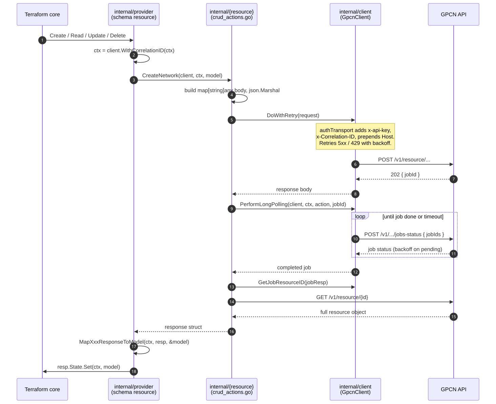

# Architecture

This document explains how the provider is built. Read it before you change code.
It covers the layers, the per-resource file layout, and the async request flow.

For per-resource *reference* (attributes, imports, example HCL), read the generated
pages under `docs/` or the Terraform Registry. This document does not repeat them.

The framework version is pinned in `go.mod` (`terraform-plugin-framework v1.19.0`).

## Three layers

The code splits into three layers. Each has one job.

| Layer | Path | Job |
| ----- | ---- | --- |
| Framework glue | `internal/provider/` | Register with Terraform. Define schemas. Convert plan/state to models. Delegate the work. |
| Per-resource logic | `internal/{resource}/` | Build API requests. Parse responses. Map responses to state models. |
| Shared client | `internal/client/` | Send HTTP requests. Authenticate. Retry. Poll async jobs. Trace with correlation IDs. |

The rule to remember: `internal/provider/` holds framework code, `internal/{resource}/`
holds API code, and neither reaches past the client for HTTP.

### Framework glue — `internal/provider/`

- `provider.go` is the root. `Configure` (around `provider.go:97`) reads provider
  config, falls back to `GPCN_HOST` / `GPCN_API_KEY` env vars, validates them,
  builds a `*client.GpcnClient`, and hands it to every resource and data source.
- `Resources()` and `DataSources()` are two slices of constructor functions. **To
  register a new resource, add its constructor to the `Resources()` slice.** Both
  slices live at the bottom of `provider.go`.
- Each `{resource}_resource.go` file holds the schema, the `Configure` type
  assertion, and thin `Create`/`Read`/`Update`/`Delete` methods that delegate to
  the resource package.

### Per-resource logic — `internal/{resource}/`

One package per resource. The files and their jobs:

| File | Job |
| ---- | --- |
| `resource_model.go` | The `ResourceModel` struct, the API response structs, and `MapXxxResponseToModel`. |
| `crud_actions.go` | The API calls: `CreateX` / `GetX` / `UpdateX` / `DeleteX`. |
| `constants.go` | Endpoint base URLs and domain constants. |
| `errors.go` | `ErrSummary*` and `ErrDetail*` message constants. |
| `logging.go` | `Log*` message constants. |
| `validators.go` | Custom validators (optional). |
| `plan_modifiers.go` | Custom plan modifiers (optional). |

`networks` is the canonical example. It has the full file set and clean async CRUD.
Study it first. See [adding-a-resource.md](adding-a-resource.md).

### Shared client — `internal/client/`

- `client.go` — `GpcnClient` and `authTransport`. The transport adds the `x-api-key`
  header, adds the correlation ID header, prepends the configured host to the request
  path, and converts a `>= 400` response into a typed `*HTTPError`. `DoWithRetry`
  retries `5xx` and `429` with exponential backoff.
- `polling.go` — `PerformLongPolling` polls the jobs endpoint until the job completes,
  fails, or times out. `GetJobResourceID` and `GetJobID` read job fields with bounds
  checks.
- `correlation.go` — `WithCorrelationID` puts a new UUID in the context. Every CRUD
  function calls it first, so one trace ID follows the whole operation through the logs.

## The async request flow

Most create, update, and delete calls are asynchronous. The API returns a job ID, and
the provider polls until the job finishes. This is the most important flow to
understand.

The steps, using create as the example:

1. The provider `Create` method sets the correlation ID: `ctx = client.WithCorrelationID(ctx)`.
2. It delegates to the package function, e.g. `networks.CreateNetwork(client, ctx, model)`.
3. The function builds a `map[string]any` body and marshals it to JSON.
4. It sends the request with `gpcnClient.DoWithRetry(request)`. The transport adds
   auth, correlation, and host. It retries transient failures.
5. The response carries a job ID. The function calls `client.PerformLongPolling`.
6. The poller loops against the jobs endpoint until the job completes or times out.
7. The function reads the new resource ID with `client.GetJobResourceID`.
8. It does a final `GET` for the full object and returns it.
9. The provider maps the object into the model with `MapXxxResponseToModel` and sets
   state.

Read (`GetX`) is a plain `GET` with no polling. The provider `Read` treats
`client.IsNotFound(err)` as drift and calls `resp.State.RemoveResource(ctx)`.

## Simple vs advanced resources

- **Simple** (`networks`, `gpu`, `volumes`, `sshkeys`, `resourcegroups`): the flow
  above, one resource per call.
- **Advanced** (`virtualmachines`): adds `ModifyPlan` to decide `RequiresReplace` at
  plan time, a stop/modify/start lifecycle, and "IfChanged" update helpers that each
  return `diag.Diagnostics`. Read `networks` before you read `virtualmachines`.

## Data sources

Data sources are read-only. They live entirely in `internal/provider/{name}_data_source.go`
(model, response struct, and API logic in one file) plus a small package holding only
`constants.go` and `errors.go`. `datacenters` is the example.

## How the reference docs are generated

`make generate` runs `terraform-plugin-docs`. It builds the `docs/` pages from the
schema `Description` fields plus the `examples/` files. **The schema descriptions are
the user-facing docs.** Write them with care, and never hand-edit `docs/` — the next
`make generate` overwrites it.
